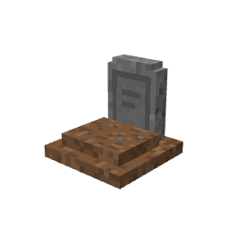

# GraveStone

A PowerNukkitX plugin that replaces death drops with a **gravestone block**.
When a player dies, their whole inventory (armor and offhand included) and,
optionally, their XP levels are stored inside a custom gravestone placed at
the exact death location. The content lives in the block entity's NBT, so
graves **survive server restarts**.



## Features

- Custom block `gravestone:gravestone` with a dedicated model
  (`geometry.tombstone`) and a 32x32 pixel-art texture.
- Death drops and XP levels are captured on `PlayerDeathEvent` and stored in
  the grave's block entity — nothing falls on the ground.
- Full NBT persistence: graves and their content are reloaded from the chunk
  data after a restart.
- Two recovery modes: break the grave, or right-click it.
- Owner-only protection (with a bypass permission for staff).
- The resource pack is **embedded in the plugin jar** and loaded by the PNX
  `ResourcePackManager` at boot — no manual copy into `resource_packs/`.
- Respects the `keepInventory` game rule (no grave is created when it is on).
- Items with Curse of Vanishing vanish, like vanilla.
- Graves are blast-proof and cannot be moved by pistons.

## Installation

1. Drop `GraveStone-x.y.z.jar` into your server's `plugins/` folder.
2. Restart the server.
3. Clients are prompted to download the gravestone resource pack
   automatically when they join.

## Configuration (`config.yml`)

| Option | Default | Description |
| --- | --- | --- |
| `enabled-worlds` | `["*"]` | Worlds where graves spawn. A list containing `"*"` **or** an empty list means every world. Otherwise list world folder names explicitly. |
| `recovery-mode` | `"break"` | `"break"`: recover by breaking the grave. `"interact"`: recover by right-clicking it. In interact mode, breaking still returns the content so nothing is lost. |
| `gravestone-hardness` | `0.5` | Server-side hardness of the block (vanilla scale; stone is 1.5). Needs a restart to apply, since the block is registered once at startup. |
| `save-xp-in-grave` | `true` | `true`: XP levels are stored in the grave and restored on recovery. `false`: XP drops as orbs at the death point, like vanilla. |
| `owner-only` | `true` | Only the grave's owner may open or break it. Players with `gravestone.bypass` ignore the check. |
| `direct-to-inventory` | `true` | `true`: recovered items go straight into the player's inventory, leftovers drop at the grave. `false`: everything drops at the grave. |
| `messages.*` | see file | Chat messages, with `{x}`, `{y}`, `{z}`, `{world}`, `{player}` placeholders. Set a message to `""` to disable it. |

## Commands & permissions

| Command | Permission | Default | Description |
| --- | --- | --- | --- |
| `/gravestone reload` | `gravestone.command` | op | Reloads `config.yml`. |
| — | `gravestone.bypass` | op | Open/break any grave even with `owner-only` enabled. |

## Building

```bash
./gradlew build
```

The jar lands in `build/libs/`. The build compiles against
`org.powernukkitx:server` from `repo.powernukkitx.org` (version set by
`pnxVersion` in `gradle.properties`). To build against a local server jar
instead, drop it into a `libs/` folder at the project root — it then takes
precedence over the remote artifact.

## Compatibility

- PowerNukkitX API `3.0.x` (`org.powernukkitx` packages).
- Java 21.

## How it works

- The block is registered through `BlockRegistry#registerCustomBlock`, with a
  `CustomBlockDefinition` that points at `geometry.tombstone` and the
  `gravestone` terrain texture; the collision/selection box matches the model
  (16x15x16).
- The block entity is registered in `BlockEntityRegistry` under the save id
  `GraveStone` during `onLoad`, before any world chunk is read, so stored
  graves deserialize correctly at startup.
- Items are serialized with the server's own `ItemHelper` (the same NBT layout
  vanilla containers use), which keeps enchantments, custom names and
  block-state data intact.
- The resource pack ships inside the jar under `assets/resource_pack/`; the
  PNX `JarPluginResourcePackLoader` picks it up from `plugins/` at boot and
  serves it to clients.

## License

[MIT](LICENSE)
